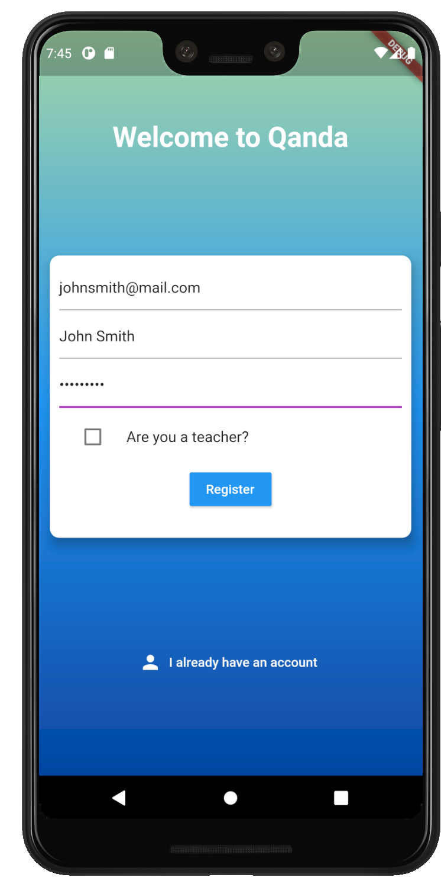
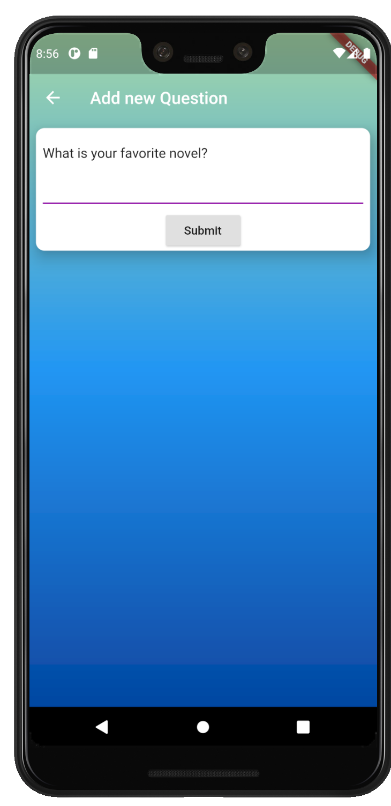
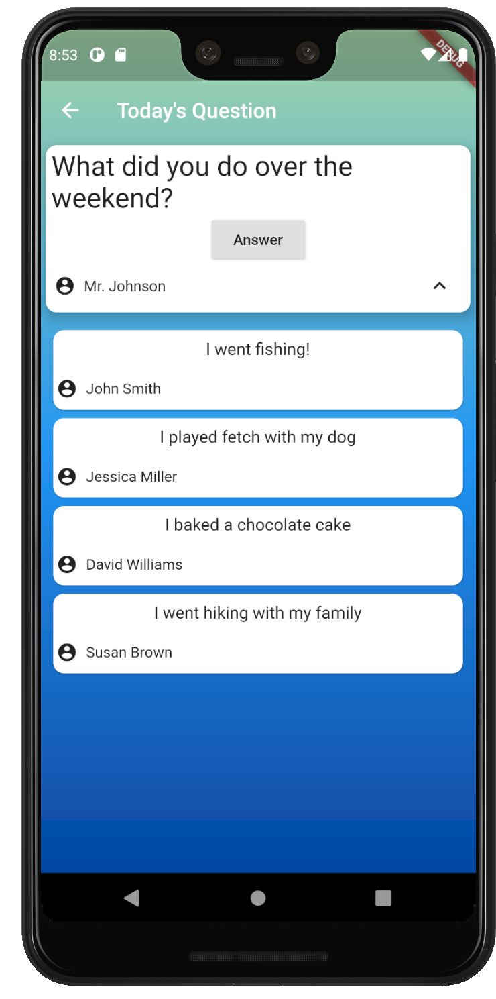
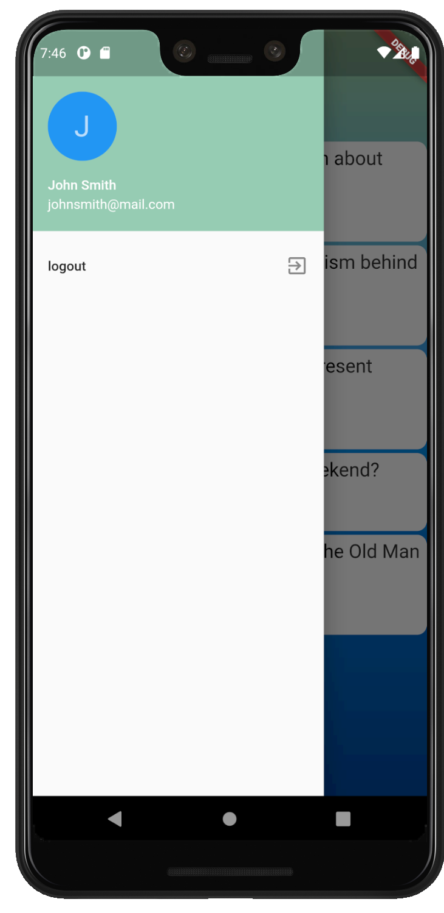

# Qanda - A Mobile Classroom Discussion Application

## What is it?
Qanda is a mobile messaging application that provides classrooms with the opportunity to discuss and answer questions in an online learning environment. The app allows teachers to interact with students by posting discussion questions and having students answer them. The app currently supports both Android and iOS devices.
## How did we build it?
* [Flutter](https://flutter.dev/) – Beautiful native app written in dart
* [Firebase](https://firebase.google.com/) – NoSQL database for discussion and user data, and user authentication 
* [Android Studio](https://developer.android.com/studio) – Code development and testing 
## Check it out 
### Screenshots:

   
  
    
  
  
   
  

## Features we hope to add soon
* User profile pictures
* A theme selection

